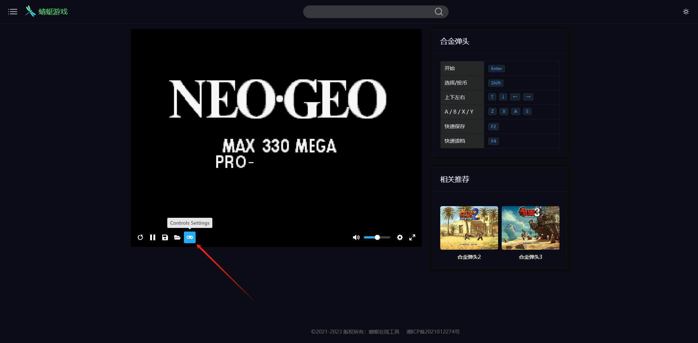

# Nes 游戏手柄、街机、FC、SFC

----

在想摸鱼的时候，想和朋友玩玩老游戏，例如：合金弹头、三国战绩，
但是时常苦于在电脑上玩只能俩人而且屁大一点的键盘很难受。

这时，这个工具闪亮登场：`NesHandle` 支持多个玩家同时不适用键盘玩这些游戏。

原理很简单，一可以模拟点击的后端、一个有各种按钮的前端，启动后通过手机打开前端按钮即可。

# 截图

# 游玩网站

- 小霸王: [https://www.yikm.net/](https://www.yikm.net/)
- 蜻蜓游戏: [https://33tool.com/games/](https://33tool.com/games/)
- wgame80游戏: [https://wgame80.com/](https://wgame80.com/)
- 蓝叶工具箱: [https://lanye.co/emugame/](https://lanye.co/emugame/)

# 配置

